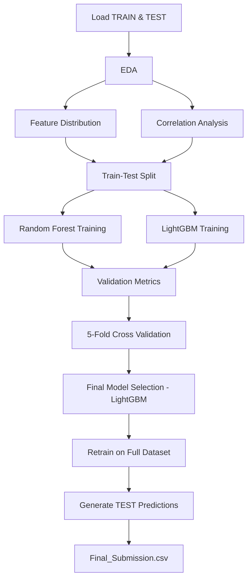

#  Device Fault Detection using LightGBM
### IEEE SB GEHU ML Challenge — Round 1 | Team Hashmap

---

## Problem Statement

Build a **binary classification model** to predict whether a device is:

| Class | Meaning |
|-------|---------|
| **0** | Normal — device operating under expected conditions |
| **1** | Faulty — device exhibiting a fault condition |

The dataset contains **47 numerical features (F01–F47)** generated by an embedded monitoring system. This is a supervised tabular machine learning problem focused on **fault detection**.

---

## Dataset Overview

| Property | Value |
|----------|-------|
| Features | 47 numerical variables (`F01 – F47`) |
| Target Variable | `Class` |
| Training Samples | **43,776** |
| Task Type | Binary Classification |
| Split Strategy | Stratified 80-20 |

### Class Distribution

| Class | Count | Percentage |
|-------|-------|------------|
| 0 — Normal | 26,465 | 60.45% |
| 1 — Faulty | 17,311 | 39.54% |

The dataset is moderately balanced. Stratification was applied to preserve class ratios during splitting.

---

## Exploratory Data Analysis (EDA)

### Data Quality
- No missing values detected
- No duplicate records
- All features are numeric — no encoding required

### Distribution Analysis
KDE plots were generated for the top high-variance features. The following showed strong class separation:

> `F31, F38, F37, F32, F33, F36, F30, F35, F34, F40, F19`

### Correlation Analysis
- Pearson correlation matrix computed and visualized as a heatmap
- No extreme multicollinearity (threshold > 0.95) detected
- Dimensionality reduction was **not required**

---

## Data Preprocessing

- Target column removed from training features
- Stratified 80-20 train-validation split (`random_state=42`)
- No feature scaling applied — tree-based models used throughout

---

## Model 1: Random Forest (Baseline)

```python
RandomForestClassifier(
    n_estimators=300,
    max_depth=None,
    min_samples_split=2,
    random_state=42,
    n_jobs=-1
)
```

| Metric | Score |
|--------|-------|
| Validation Accuracy | **98.46%** |
| 5-Fold CV Accuracy | **98.21%** |

---

## Final Model: LightGBM

Gradient boosting outperformed the Random Forest baseline across all metrics.

```python
LGBMClassifier(
    n_estimators=1000,
    learning_rate=0.05,
    num_leaves=31,
    subsample=0.8,
    colsample_bytree=0.8,
    random_state=42
)
```

### Validation Results

| Metric | Score |
|--------|-------|
| Validation Accuracy | **98.93%** |
| 5-Fold CV Mean Accuracy | **~98.8%** |

### Classification Report

| Class | Precision | Recall | F1-Score |
|-------|-----------|--------|----------|
| 0 — Normal | 0.99 | 1.00 | 0.99 |
| 1 — Faulty | 0.99 | 0.98 | 0.99 |

### Confusion Matrix

```
Predicted:     Normal   Faulty
Actual Normal  [ 5269      24 ]
Actual Faulty  [   70    3393 ]
```

- **False Positives (FP):** 24 — normal devices flagged as faulty
- **False Negatives (FN):** 70 — faulty devices missed
- Extremely low misclassification on both sides

The small gap between validation accuracy and CV mean score confirms **strong generalization** with minimal overfitting.

---

## Feature Importance

LightGBM's importance analysis identified the following as top contributors:

`F31 · F38 · F37 · F32 · F33 · F30`

These align with the high-variance features flagged during EDA, confirming that tree-based models successfully captured the nonlinear interactions driving fault classification.

---

## End-to-End Pipeline



---

## Project Structure

```
.
├── TRAIN.csv                  # Training data (43,776 samples)
├── TEST.csv                   # Test data for submission
├── EDA.ipynb                  # Exploratory data analysis notebook
├── Model_Training.ipynb       # Model training & evaluation notebook
├── lgb_model.pkl              # Saved LightGBM model (joblib)
├── Final_Submission.csv       # Final predictions (ID → CLASS)
├── app.py                     # Streamlit inference app
└── README.md
```

---

## Running the Streamlit App

```bash
pip install streamlit lightgbm scikit-learn pandas matplotlib seaborn joblib
streamlit run app.py
```

Upload any CSV with columns `ID, F01–F47` to get:
- Per-device predictions (Normal / Faulty)
- Confidence scores
- Downloadable output CSV
- Evaluation metrics (if ground truth labels are provided)

---

## Submission Format

```csv
ID,CLASS
1,0
2,1
3,0
...
```

Saved as `Final_Submission.csv`. Row count and order match `TEST.csv` exactly.

---

## Technologies Used

`Python` · `Pandas` · `NumPy` · `Scikit-learn` · `LightGBM` · `Seaborn` · `Matplotlib` · `Joblib` · `Streamlit`

---

## Key Strengths

| | |
|-|-|
| ✅ | ~99% validation accuracy |
| ✅ | Balanced precision & recall across both classes |
| ✅ | Very low false positives and false negatives |
| ✅ | Stable cross-validation (minimal variance) |
| ✅ | Proper stratified splitting |
| ✅ | Reproducible pipeline (`random_state=42` throughout) |
| ✅ | Production-ready Streamlit inference app |

---

## Author

**Team Hashmap** — IEEE SB GEHU ML Challenge
